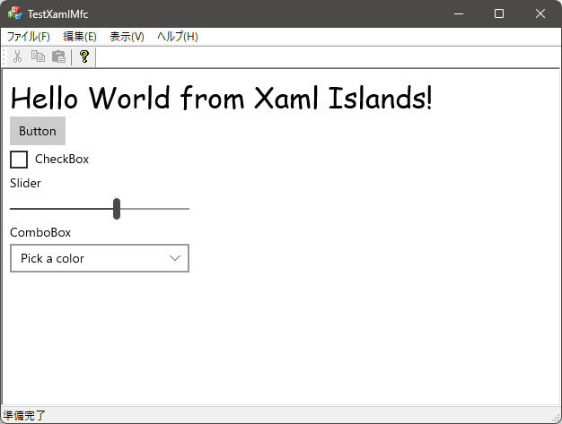

# TestXamlMfc
 

WinRT XAML Islandsを使ってレガシーコードにXAMLコンテンツを統合する実験。

## NuGetパッケージ

- Microsoft.Toolkit.Win32.UI.SDK 6.1.2
- Microsoft.Windows.CppWinRT 2.0.240405.15

## 今後の課題

- バインディング出来ていない
- 描画スタイルがFluent Designではない

## 参考

[C++ デスクトップ (Win32) アプリで標準 WinRT XAML コントロールをホストする](https://learn.microsoft.com/ja-jp/windows/apps/desktop/modernize/xaml-islands/host-standard-control-with-xaml-islands-cpp)
